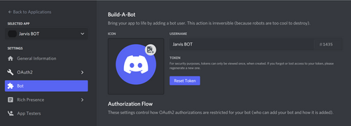
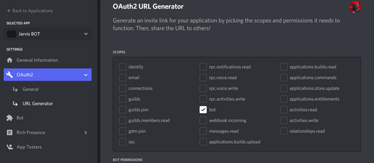
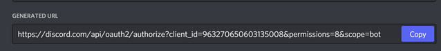
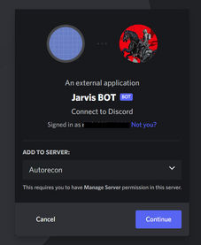

# Setting up Discord Developer Application

[Reference](https://www.cyberick.com/post/create-your-own-discord-bot-for-recon-bug-bounty)

- Go to https://discord.com/developers/applications

- Click on New Applications button at top right

- Enter Name of your application like "Jarvis BOT" and click on create

- You can add icon if you want (Optional)

- Left side, click on "Bot" in menu and Click on Add BOT button -> Click on "Yes Do it" button

- Click on Reset Token button and click on "Yes Do it" button

- Now copy this token and paste it in notepad for future use

- Click on "OAuth2" on left side menu -> Click on URL generator under that

- In Scopes, check "Bot"

- Scroll down and give permissions, you can give Administrator permissions for testing

- Scroll down and copy the generated URL

- Now visit this generated URL and select your server where you want to add this BOT

- Click on continue and Authorize

- Check your Discord Server

